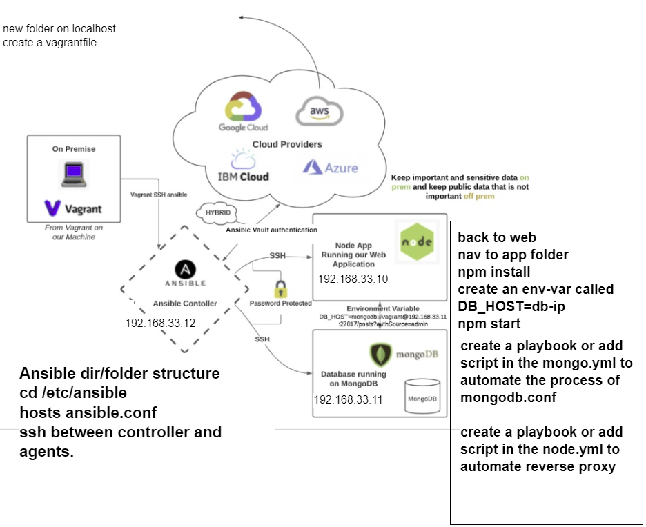
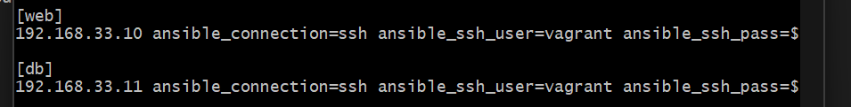

# Setting up Ansible
- Run `vagrant init` to make a new vagrant file and include the following code:
```
Vagrant.configure("2") do |config|
  # creating are Ansible controller
    config.vm.define "controller" do |controller|
      
     controller.vm.box = "bento/ubuntu-18.04"
     
     controller.vm.hostname = 'controller'
     
     controller.vm.network :private_network, ip: "192.168.33.12"
     
     # config.hostsupdater.aliases = ["development.controller"] 
     
    end 
  # creating first VM called web  
    config.vm.define "web" do |web|
      
      web.vm.box = "bento/ubuntu-18.04"
     # downloading ubuntu 18.04 image
  
      web.vm.hostname = 'web'
      # assigning host name to the VM
      
      web.vm.network :private_network, ip: "192.168.33.10"
      #   assigning private IP
      
      #config.hostsupdater.aliases = ["development.web"]
      # creating a link called development.web so we can access web page with this link instread of an IP   
          
    end
    
  # creating second VM called db
    config.vm.define "db" do |db|
      
      db.vm.box = "bento/ubuntu-18.04"
      
      db.vm.hostname = 'db'
      
      db.vm.network :private_network, ip: "192.168.33.11"
      
      #config.hostsupdater.aliases = ["development.db"]     
    end
  
  
  end
  ```
- Run `Vagrant up` to set up all 3 vm machines
- In each machine run the command `sudo apt update && upgrade -y` 
- `ssh` into your controller machine and install ansible. Below are the commands:
```
sudo apt-get install software-properties-common

sudo apt-add-repository ppa:ansible/ansible
# When running this, you might be prompted to ENTER mid-process. If so, pelase press ENTER

sudo apt-get update -y 

sudo apt-get install ansible -y

ansible --version
# to double-check the version of ansible
# although we did not install python, as it is one of the requirements for ansible, it installed it and it is using the default version (python 2.7)

cd etc/

cd ansible/

# this confirms that we have an Ansible Controller set up
```
- `ssh` into your web machine through your controller machine using the command `ssh vagrant@YOUR_IP`
- Exit back into your controller machine and go into the ansible folder `cd /etc/ansible/`
- Edit the `hosts` files to include the web and db ip addresses so when we ping them the controller can look for these in the host file.
- Save the new updated file and run the command `sudo ansible -m ping all`. This will check to see if a communication can be made between the controller and the other agent nodes.


## Potential blockers
- Sometime when trying to run the ping command and error may arise saying:
```
Using a SSH password instead of a key is not possible because Host Key checking is enabled and sshpass does not support this.  Please add this host's fingerprint to your known_hosts file to manage this host."
```
- In order to fix this we need to nano into the ansible.config file and include `host_key_checking = false`. After saving this change this will bypass the blocker and allow us to ping to the other agent nodes.

- An important step is to setup our node agent ip address to allow communication between our controller node and our agent node. The following configuration should be done in the host file.


- Now we begin writing playbooks to setup our 2 agent node, app and db. Our first playbook will be to git clone our repo onto our web node agent. Use the following YAML playbook.
```
---
- hosts: web
  gather_facts: yes
  become: true


  tasks:
  - name: Cloning GIT
    git:
      repo: https://github.com/mb689/multi_virtualMachines-tech201-.git
      dest: /home/vagrant/repos
      clone: yes
```

- Now we need to write a playbook to install all the dependecies for db node such as the lastest version of mongodb. As well as configure the mongodb.conf file to allow all ips to access the db. Use the following playbook to achieve this.
```
---

- hosts: db

  gather_facts: yes

  become: true

  tasks:
  - name: install mongodb
    apt: pkg=mongodb state=present

  - name: Remove mongodb file (delete file)
    file:
      path: /etc/mongodb.conf
      state: absent

  - name: Touch a file, using symbolic modes to set the permissions (equivalent to 0644)
    file:
      path: /etc/mongodb.conf
      state: touch
      mode: u=rw,g=r,o=r


  - name: Insert multiple lines and Backup
    blockinfile:
      path: /etc/mongodb.conf
      block: |
        # mongodb.conf
        storage:
          dbPath: /var/lib/mongodb
          journal:
            enabled: true
        systemLog:
          destination: file
          logAppend: true
          path: /var/log/mongodb/mongod.log
        net:
          port: 27017
          bindIp: 0.0.0.0

  - name: Restart mongodb
    become: true
    shell: systemctl restart mongodb

  - name: enable mongodb
    become: true
    shell: systemctl enable mongodb

  - name: start mongodb
    become: true
    shell: systemctl start mongodb

```

- The last important step to set everything up is to create another playbook for our app node to install all the dependencies needed such as nodejs, npm, pm2 and nginx. We also need to include the task to add a env var to allow communication between the 2 agent nodes. The last task in this playbook should be to seed the database and to begin running the app using pm2. Use the following playbook:
```
---
- hosts: web
  gather_facts: yes
  become: true

  tasks:
  - name: Add environmental variable
    shell:  echo 'export DB_HOST="mongodb://192.168.33.11:27017/posts"' >> ~/.bashrc && source .bashrc
    args:
      executable: /bin/bash


  - name: Install NPM
    shell: |
      #!/bin/bash
      curl -sL https://deb.nodesource.com/setup_12.x | sudo -E bash -
      sudo apt-get install nodejs -y
      sudo npm install pm2 -g

  - name: start app
    shell: |
      #!/bin/bash
      cd /home/vagrant/repos/app/app
      npm install
      node seeds/seed.js
      pm2 kill
      pm2 start app.js
    environment:
      DB_HOST: mongodb://192.168.33.11:27017/posts
```

- We can add an optional playbook to setup a reverse proxy on our nginx. The following playbook will achieve this. 
```
---

- hosts: web

  gather_facts: yes

  become: true


  tasks:
  - name: Install nginx
    apt: pkg=nginx state=present

#  - name: Setup reverse proxy
#    shell: |
#      #!/bin/bash
#      sudo rm /etc/nginx/sites-available/default
#      sudo cp /home/vagrant/repos/app/app/reverse_proxy /etc/nginx/sites-available/default
#     sudo systemctl restart nginx

  - name: Disable nginx Default Virtual Host
    become: yes
    ansible.legacy.command:
     cmd: unlink /etc/nginx/sites-enabled/default

  - name: Create nginx conf file
    become: yes
    file:
      path: /etc/nginx/sites-available/node_proxy.conf
      state: touch

  - name: Amend nginx conf file
    become: yes
    blockinfile:
     path: /etc/nginx/sites-available/node_proxy.conf
     marker: ""
     block: |
       server {
           listen 80;
           location / {
                proxy_pass http://192.168.33.10:3000;
            }
        }
  - name: Link nginx Node Reverse Proxy
    become: yes
    command:
      cmd: ln -s /etc/nginx/sites-available/node_proxy.conf /etc/nginx/sites-en$

  - name: Make sure nginx service is running
    become: yes
    service:
      name: nginx
      state: restarted
      enabled: yes
```

# Launch EC2 instance with Ansible

- First install all the required dependencies on your controller node.
```
sudo apt update
sudo apt install tree -y
sudo apt-add-repository --yes --update ppa:ansible/ansible
sudo apt install ansible -y
sudo apt install python3-pip
pip3 install awscli
pip3 install boto boto3 -y
sudo apt update
sudo apt upgrade
alias python=python3
```

## Securing Aws Keys
- Now we need to create a vault to secure our aws keys
- Create a new folder using the command `mkdir AWS_ANSIBLE`
- `cd` into and create a directory `mkdir /group_vars/all`
- Within the `all` folder, run the command `ansible-vault create pass.yml` to create your vault for your keys.
- Press `i` to begin inserting the keys as the follwoing:
  - `aws_access_key: your aws access key`
  - `aws_secret_key: your aws secret key`
- Press `esc` > `:wq!` > `Enter` to save the file
- If it asks for a password set it to `vagrant`
- Change the permissions on the `pass.yml` file using the command `sudo chmod 666 pass.yml`

## Importing .pem file and creating ssh keys
- First `cd` into your `.ssh` file: `cd ~/.ssh`
- Create a new `.pem` file in your ssh folder and copy your key from the other pem file that we used to ssh into ec2 instances.
- Change the permissions of the file `sudo chmod 400 <Your .pem file>`
- Generate a new ssh key pair for use in your playbook. For ease of use, name the same as .pem file.
```
ssh-keygen -t rsa -b 4096 -f ~/.ssh/<Your file name>
```

## Create a playbook to launch ec2 instance
```
---
- hosts: localhost
  connection: local
  gather_facts: True
  become: True
  vars:
    key_name: Mohamed_aws
    region: eu-west-1
    image:  ami-0b137be80f38581ca
    id: "mohamed-tech201-app-ami"
    sec_group: "sg-0cda84f1bb3223b0d"
    subnet_id: "subnet-00ac052b1e40c0164"
# add the following line if ansible by default uses python 2.7
    ansible_python_interpreter: /usr/bin/python3
  tasks:

    - name: Facts
      block:

      - name: Get instances facts
        ec2_instance_facts:
          aws_access_key: "{{aws_access_key}}"
          aws_secret_key: "{{aws_secret_key}}"
          region: "{{ region }}"
        register: result


    - name: Provisioning EC2 instances
      block:

      - name: Upload public key to AWS
        ec2_key:
          name: "{{ key_name }}"
          key_material: "{{ lookup('file', '~/.ssh/{{ key_name }}.pub') }}"
          region: "{{ region }}"
          aws_access_key: "{{aws_access_key}}"
          aws_secret_key: "{{aws_secret_key}}"

      - name: Provision instance(s)
        ec2:
          aws_access_key: "{{aws_access_key}}"
          aws_secret_key: "{{aws_secret_key}}"
          assign_public_ip: true
          key_name: "{{ key_name }}"
          id: "{{ id }}"
          vpc_subnet_id: "{{ subnet_id }}"
          group_id: "{{ sec_group }}"
          image: "{{ image }}"
          instance_type: t2.micro
          region: "{{ region }}"
          wait: true
          count: 1
          instance_tags:
            Name: Mohamed-app-ansible

      tags: ['never', 'create_ec2']
```

- Run the command `sudo ansible-playbook playbook.yml` to execute the playbook and launch the ec2 instance.