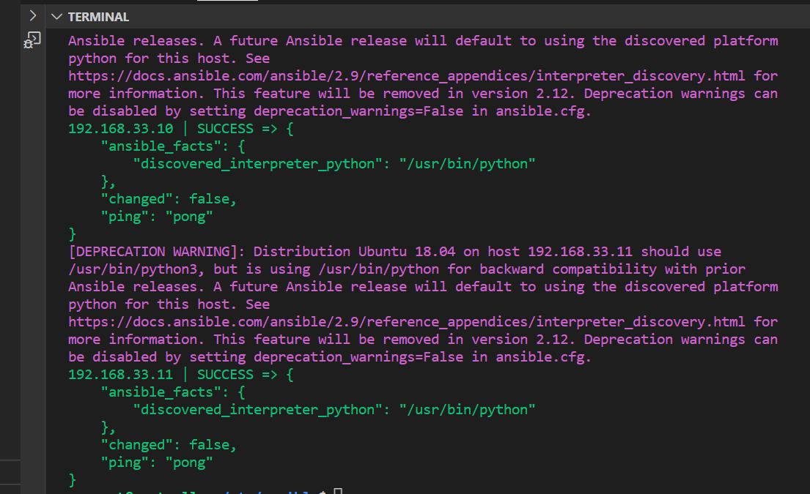

# Setting up Ansible
- Run `vagrant init` to make a new vagrant file and include the following code:
```
Vagrant.configure("2") do |config|
  # creating are Ansible controller
    config.vm.define "controller" do |controller|
      
     controller.vm.box = "bento/ubuntu-18.04"
     
     controller.vm.hostname = 'controller'
     
     controller.vm.network :private_network, ip: "192.168.33.12"
     
     # config.hostsupdater.aliases = ["development.controller"] 
     
    end 
  # creating first VM called web  
    config.vm.define "web" do |web|
      
      web.vm.box = "bento/ubuntu-18.04"
     # downloading ubuntu 18.04 image
  
      web.vm.hostname = 'web'
      # assigning host name to the VM
      
      web.vm.network :private_network, ip: "192.168.33.10"
      #   assigning private IP
      
      #config.hostsupdater.aliases = ["development.web"]
      # creating a link called development.web so we can access web page with this link instread of an IP   
          
    end
    
  # creating second VM called db
    config.vm.define "db" do |db|
      
      db.vm.box = "bento/ubuntu-18.04"
      
      db.vm.hostname = 'db'
      
      db.vm.network :private_network, ip: "192.168.33.11"
      
      #config.hostsupdater.aliases = ["development.db"]     
    end
  
  
  end
  ```
- Run `Vagrant up` to set up all 3 vm machines
- In each machine run the command `sudo apt update && upgrade -y` 
- `ssh` into your controller machine and install ansible. Below are the commands:
```
sudo apt-get install software-properties-common

sudo apt-add-repository ppa:ansible/ansible
# When running this, you might be prompted to ENTER mid-process. If so, pelase press ENTER

sudo apt-get update -y 

sudo apt-get install ansible -y

ansible --version
# to double-check the version of ansible
# although we did not install python, as it is one of the requirements for ansible, it installed it and it is using the default version (python 2.7)

cd etc/

cd ansible/

# this confirms that we have an Ansible Controller set up
```
- `ssh` into your web machine through your controller machine using the command `ssh vagrant@YOUR_IP`
- Exit back into your controller machine and go into the ansible folder `cd /etc/ansible/`
- Edit the `hosts` files to include the web and db ip addresses so when we ping them the controller can look for these in the host file.
- Save the new updated file and run the command `sudo ansible -m ping all`. This will check to see if a communication can be made between the controller and the other agent nodes.


## Potential blockers
- Sometime when trying to run the ping command and error may arise saying:
```
Using a SSH password instead of a key is not possible because Host Key checking is enabled and sshpass does not support this.  Please add this host's fingerprint to your known_hosts file to manage this host."
```
- In order to fix this we need to nano into the ansible.config file and include `host_key_checking = false`. After saving this change this will bypass the blocker and allow us to ping to the other agent nodes.