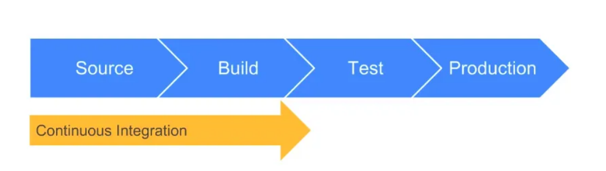
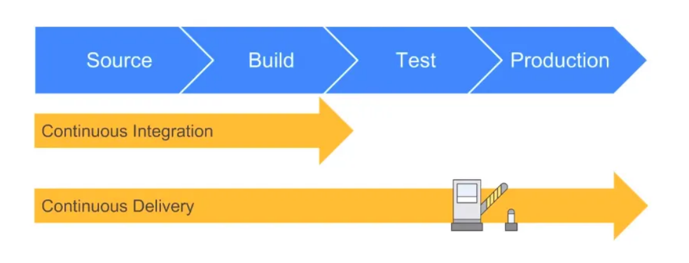
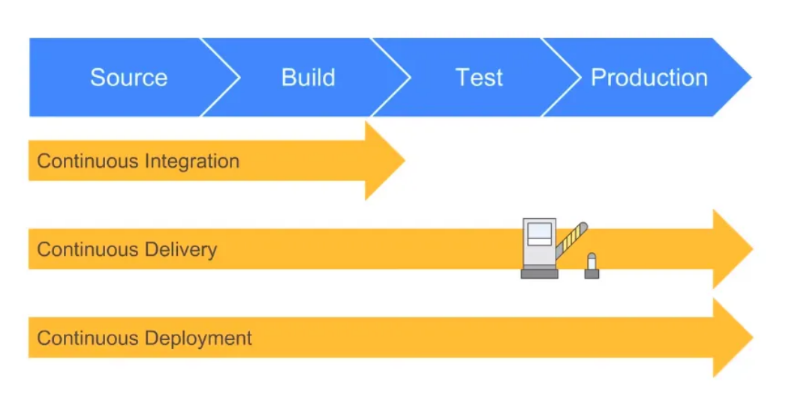
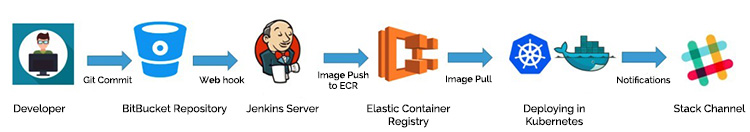

# CI VS CD VS CDE in DevOps

## What is CI (Continuous Integration)?
- CI stands for Continuous Integration, which is a key practice in DevOps. CI is the process of continuously integrating code changes from multiple developers into a shared repository or version control system and automatically building and testing the integrated code to ensure it is working as expected.
- The main goal of CI is to detect and resolve code conflicts and issues as early as possible in the development process to ensure that the code is stable and ready for deployment. It involves automating the build, testing, and deployment processes, which enables developers to identify and fix issues quickly, reduces the risk of integration problems, and makes the overall development process more efficient.
- In a CI pipeline, code changes are regularly integrated into a shared repository, triggering automated builds and tests to ensure that the code is functioning properly. Any issues are reported back to the developers, who can then take corrective action. This continuous process helps to ensure that code changes are consistently tested and verified, making it easier to identify and fix issues early in the development process.

## What is CD (Continuous Delivery)?
- CD stands for Continuous Delivery or Continuous Deployment, which is another critical practice in DevOps. CD is the process of automatically deploying code changes to production or a production-like environment after the code has passed through the Continuous Integration (CI) process and has been approved for release
- The main goal of CD is to automate the deployment process and enable organizations to deliver new features and updates to their customers more frequently and with higher quality. Continuous Delivery typically involves automating the deployment process, including tasks such as configuration management, database migration, and setting up infrastructure. Continuous Deployment goes one step further by automating the release of changes directly into production.

## What is CDE (Continuous Deployment Environment)?
- CDE stands for Continuous Deployment Environment, which is a key component of the Continuous Delivery/Deployment process in DevOps. A CDE is an automated, standardized environment where code changes can be tested, validated, and deployed automatically without manual intervention.
- The main goal of a CDE is to provide a reliable and consistent environment for software development and deployment, which can help to minimize the risk of errors and ensure that changes can be deployed rapidly and with confidence.

## What is the difference between CD & CDE in devops?
- CD is the overall process of automating the software delivery process, while CDE is a specific component of the CD process that focuses on the automated, standardized environment in which code changes are tested and deployed. While CD encompasses the entire software delivery process, including testing and deployment, CDE is focused specifically on the deployment and testing of code changes in an automated and consistent environment.

## What is Jenkins and how does it work?
- Jenkins is an open-source automation server used for Continuous Integration/Continuous Delivery (CI/CD) in DevOps. Jenkins is one of the most popular automation servers and is widely used by development teams for automating their build, test, and deployment processes.
- Jenkins works by enabling developers to create pipelines that automate the build, test, and deployment processes for their software. The pipelines consist of a series of steps that are executed automatically when changes are made to the codebase. These steps can include tasks such as checking out the code from a version control system, compiling the code, running automated tests, and deploying the application to a production environment.

## Benefits of Jenkins
- Automation: Jenkins automates the build, test, and deployment processes, reducing the need for manual intervention and increasing the speed and efficiency of the software development process.
- Integration: Jenkins integrates with a wide range of tools and technologies, including version control systems, issue tracking systems, and cloud platforms, making it easy to incorporate Jenkins into existing development workflows.
- Customization: Jenkins is highly customizable and can be configured to support a wide range of development workflows and processes, allowing teams to tailor their Jenkins setup to their specific needs.
- Scalability: Jenkins supports distributed builds, allowing multiple build agents to be used to build and test code in parallel, making it easy to scale the build process as the development team grows.

## Other examples of automation servers:
- GitLab CI/CD
- CircleCI
- Travis CI
- Bamboo
- TeamCity

## Git Workflow

## Jenkins work flow

## SDLC work flow
