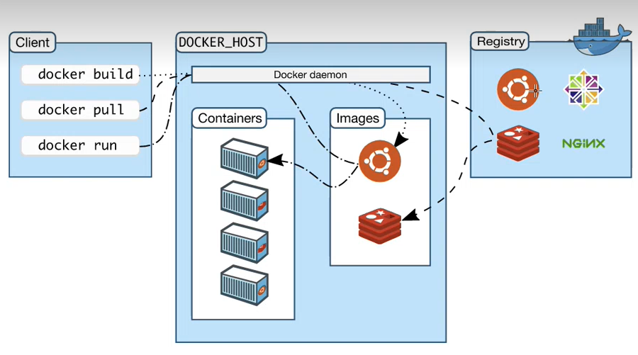

# What is Docker? 
- Docker is a software platform that enables developers to create, deploy, and run applications in containers. Containers are lightweight, standalone, and portable software packages that contain all the necessary components and dependencies required to run an application.

# What is an image in docker?
- An image is essentially a snapshot of a container, and it contains all the files and configurations needed to run the container. Images can be shared between developers and organizations, making it easy to distribute and deploy applications.

# Virtualization vs containerization
- So, in simple terms, virtualization creates multiple virtual machines, each with its own operating system, while containerization creates multiple lightweight containers that share the same operating system. Virtualization provides greater isolation between applications, but is heavier in terms of resource usage and management. Containerization provides a lightweight and portable runtime environment for applications, allowing for greater density of application deployments and faster startup times.



# Docker commands
```
Usage:  docker [OPTIONS] COMMAND

A self-sufficient runtime for containers

Options:
      --config string      Location of client config files (default
                           "C:\\Users\\mboud\\.docker")
  -c, --context string     Name of the context to use to connect to the
                           daemon (overrides DOCKER_HOST env var and
                           default context set with "docker context use")
  -D, --debug              Enable debug mode
  -H, --host list          Daemon socket(s) to connect to
  -l, --log-level string   Set the logging level
                           ("debug"|"info"|"warn"|"error"|"fatal")
                           (default "info")
      --tls                Use TLS; implied by --tlsverify
      --tlscacert string   Trust certs signed only by this CA (default
                           "C:\\Users\\mboud\\.docker\\ca.pem")
      --tlscert string     Path to TLS certificate file (default
                           "C:\\Users\\mboud\\.docker\\cert.pem")
      --tlskey string      Path to TLS key file (default
                           "C:\\Users\\mboud\\.docker\\key.pem")
      --tlsverify          Use TLS and verify the remote
  -v, --version            Print version information and quit

Management Commands:
  builder     Manage builds
  buildx*     Docker Buildx (Docker Inc., v0.10.3)
  compose*    Docker Compose (Docker Inc., v2.15.1)
  config      Manage Docker configs
  container   Manage containers
  context     Manage contexts
  dev*        Docker Dev Environments (Docker Inc., v0.1.0)
  extension*  Manages Docker extensions (Docker Inc., v0.2.18)
  image       Manage images
  manifest    Manage Docker image manifests and manifest lists
  network     Manage networks
  node        Manage Swarm nodes
  plugin      Manage plugins
  sbom*       View the packaged-based Software Bill Of Materials (SBOM) for an ima
ge (Anchore Inc., 0.6.0)
  scan*       Docker Scan (Docker Inc., v0.25.0)
  scout*      Command line tool for Docker Scout (Docker Inc., v0.6.0)
  secret      Manage Docker secrets
  service     Manage services
  stack       Manage Docker stacks
  swarm       Manage Swarm
  system      Manage Docker
  trust       Manage trust on Docker images
  volume      Manage volumes

Commands:
  attach      Attach local standard input, output, and error streams to a running
container
  build       Build an image from a Dockerfile
  commit      Create a new image from a container's changes
  cp          Copy files/folders between a container and the local filesystem
  create      Create a new container
  diff        Inspect changes to files or directories on a container's filesystem
  events      Get real time events from the server
  exec        Run a command in a running container
  export      Export a container's filesystem as a tar archive
  history     Show the history of an image
  images      List images
  import      Import the contents from a tarball to create a filesystem image
  info        Display system-wide information
  inspect     Return low-level information on Docker objects
  kill        Kill one or more running containers
  load        Load an image from a tar archive or STDIN
  login       Log in to a Docker registry
  logout      Log out from a Docker registry
  logs        Fetch the logs of a container
  pause       Pause all processes within one or more containers
  port        List port mappings or a specific mapping for the container
  ps          List containers
  pull        Pull an image or a repository from a registry
  push        Push an image or a repository to a registry
  rename      Rename a container
  restart     Restart one or more containers
  rm          Remove one or more containers
  rmi         Remove one or more images
  run         Run a command in a new container
  save        Save one or more images to a tar archive (streamed to STDOUT by defa
ult)
  search      Search the Docker Hub for images
  start       Start one or more stopped containers
  stats       Display a live stream of container(s) resource usage statistics
  stop        Stop one or more running containers
  tag         Create a tag TARGET_IMAGE that refers to SOURCE_IMAGE
  top         Display the running processes of a container
  unpause     Unpause all processes within one or more containers
  update      Update configuration of one or more containers
  version     Show the Docker version information
  wait        Block until one or more containers stop, then print their exit codes

Run 'docker COMMAND --help' for more information on a command.
```


# Docker Task
- Task is to run an nginx container from docker hub using the command `docker run -d -p 80:80 nginx`
- Now enter you container using the command `docker exec -it <Container-ID> sh`
- Navigate to the index.html file `/usr/share/nginx/html` and make a change to index.html file using `nano index.html`
- Save changes and exit the container shell using the command `exit`
- Stop the container from running using the command `docker stop <Container-ID>`
- Commit the changes of the container using the command `docker commit <Container-ID> <Image-name>` give it an image name.
- `docker images` to check if your images is available
- You can now give you image a tag by using the command `docker tag <image-name> <docker-hub-username>/<repository-name>:<tag-name>`
- Login into docker-hub `docker login --username=<docker-hub-username>`
- Lastly push the image to docker hub `docker push <docker-hub-username>/<repository-name>:<tag-name>`

# Automating of docker image
- Create an `index.html` and create some headers.
- In the same folder create a `Dockerfile`.
- Within the docker file include the following code:
```
# Select base image
FROM nginx

# Label it
LABEL MAINTAINER=Mohamed@sparta

# copy data from localhost to the container
COPY index.html /usr/share/nginx/html/

# Allow required port
EXPOSE 80

# Execute requried command 
CMD ["nginx", "-g", "daemon off;"]
```
- Now build the image using the command `docker build -t <Image name> .`
- Then run a contianer based on the image `docker run <Image name>`
- Finally you can push the image to docker hub `docker push <docker-hub-usernamne>/<repo-name>`

### For Node app
- To automate the start node app with docker copy the above instructions but change the contents of the `Dockerfile` with@
```
FROM node:14

WORKDIR /app

COPY app/package*.json ./

RUN npm install

COPY app/ .

EXPOSE 3000

CMD ["node", "app.js"]
```
- Make sure the Dockerfile is stored in the same place as your app folder