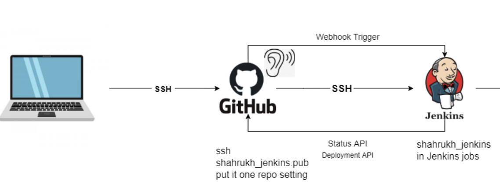
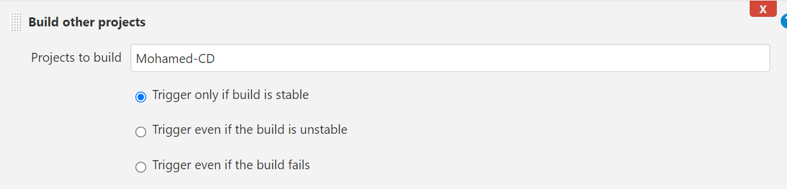

# How to create CI / CD pipeline with Jenkins

## Creating the CI part of the pipeline


- Step1 -> Create a new job in Jenkins and connect your Github using your `ssh` link. Setup the job so that whenever any pushes are made to the github it will be pushed to the dev branch. 

- Step2 -> Setup a webhook in github to listen for any changes to the repo to be refelected on Jenkins. 
- Step3 -> In the execute shell make sure to include `npm install` & `npm test` so that the build can be tested and so can allow us to complete the next step in our pipeline.

- Now we need to create another job with the same configuration as the other job but now we need to include the option to merge the dev branch to main branch if the tests have passed. 
- In the post build option we need to select our next build, `CD` and select only carry on if our current build, `to merge`, is stable.

- Now select `git publisher` and configurate it so that the `dev` branch is merged into the `main` branch.

- We need to also go back to our previous job, our first one, and include post built action so that when the first job is built and is successful then this new job we have just made will begin to be built.


## Creating the CD part of the pipeline
- For the CD we create another Job with the same configuration as our first job. But we need to add more configuration to it such as Build triggers. We want our third job to watch the job before it, the merging job, and see if that is successful and if that is it will begin to build itself.


- Now we need to create a new `SSH agent` which will contain our key to allow us to ssh into our app instace in an automated way through our execution shell. 


- Go onto your aws account and create a new instance using your AMI which has most of the onfiguration setup for you. We need to make some change for our security group which you can copy below:


- Now the last step to do is add the instructions for jenkins to start up our app automatically each time. In the shell we include the following commands:
```
rsync -avz -e "ssh -o StrictHostKeyChecking=no" app ubuntu@34.243.84.49:/home/ubuntu
ssh -o "StrictHostKeyChecking=no" ubuntu@34.243.84.49 <<EOF
    sudo bash ./app/app/provsion.sh
    cd app
    cd app
    npm install
    nohup npm start 2>/dev/null 1>/dev/null&

EOF
```
- The above commands ssh into our instance and executes our scipts then it changes directories into our app and begins to run it infinetly.


## Checking if the pipeline is working
- We can go onto our gitbash and make any changes to any files within the app and then we can push it to github `git push`. Jenkins will then automate everything for us according to how we set it up. We can verify the change by entering our public ip address in our browser.


