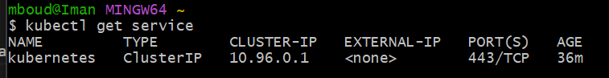

# What is Kubernetes?
- In simple terms, Kubernetes helps you manage and orchestrate multiple containers, which can be thought of as lightweight, standalone packages of software that contain all the necessary code, libraries, and dependencies to run your application. With Kubernetes, you can easily deploy your containers to a cluster of servers, scale your application up or down to meet demand, and ensure that your application is always running smoothly.

# What is a Kubernete Object?
- A K8 object is a configuration or definition that describes the desired state of a Kubernetes resource. In other words, it is a representation of a Kubernetes resource, such as a deployment, service, or pod, that you want to create or modify in your cluster.
- Kubernetes uses YAML files to define K8 objects, which contain a set of key-value pairs that specify the properties of the resource you want to create. For example, a deployment K8 object might include information about the number of replicas you want to run, the container image to use, and the ports to expose.
```
Nodes: These are the individual machines or virtual machines that make up the cluster. Nodes are where containers are actually run, and they provide the compute, storage, and networking resources needed to run containerized applications.

Control Plane: This is the main management component of the K8s architecture. It consists of several components that work together to manage the state of the cluster, including the API server, etcd, scheduler, and controller manager.

API Server: This component provides a RESTful interface for interacting with the K8s control plane. It handles requests from users and administrators, and communicates with the etcd database to manage the state of the cluster.

etcd: This is a distributed key-value store that stores the configuration data and state of the entire cluster. It acts as the "brain" of the K8s control plane, and ensures that all nodes in the cluster have consistent and up-to-date information about the state of the system.

Scheduler: This component is responsible for scheduling containerized applications onto nodes in the cluster. It takes into account factors like resource availability and node capacity to make intelligent placement decisions.

Controller Manager: This component runs a set of controllers that monitor the state of the cluster and make changes as necessary to ensure that the desired state is maintained. For example, it might monitor the state of a deployment and automatically scale up or down the number of replicas based on demand.

Add-ons: K8s also includes a set of optional add-ons, such as the DNS service, dashboard, and network plug-ins, that provide additional functionality for managing containerized applications.
```

# Benefits of Kubernete
- Automation: K8s automates many of the tasks involved in deploying and managing containerized applications, including load balancing, scaling, and self-healing. This helps to reduce the burden on operations teams, and ensures that your applications are always running smoothly.
- Scalability: K8s provides a highly scalable platform for deploying and managing containerized applications. It can automatically scale your applications up or down based on demand, and can manage clusters with thousands of nodes.
- Resilience: K8s is designed to be highly resilient and fault-tolerant. It can automatically detect and recover from failures, and can distribute traffic across multiple nodes to ensure high availability.

# K8 dependencies
```
Container runtime: Kubernetes relies on a container runtime to run and manage containers. The most commonly used container runtimes are Docker and containerd, but Kubernetes can also work with other runtimes like CRI-O.

Networking: Kubernetes requires a network overlay to provide communication between pods and nodes. There are several networking plugins available for Kubernetes, including Calico, Flannel, and Weave Net.

Storage: Kubernetes supports several storage backends, including local storage, network-attached storage (NAS), and storage area networks (SANs). Depending on your storage requirements, you may need to install additional software to support your chosen storage backend.

Operating system: Kubernetes can be installed on a variety of operating systems, including Linux, Windows, and macOS. However, some features of Kubernetes may be specific to certain operating systems, so it's important to choose the right operating system for your needs.

Infrastructure: Finally, Kubernetes requires infrastructure to run on, such as physical servers or virtual machines. The infrastructure needs to have enough resources to support the number of nodes and pods in your Kubernetes cluster.
```

# K8 APIs
- In simple terms, an API (Application Programming Interface) is a set of rules that allows different software applications to communicate with each other. In the context of Kubernetes, the APIs provide a standardized way for users to interact with the Kubernetes control plane, regardless of which programming language or tool they are using.

# K8 cluster setup (Windows)
- 1 - Launch Docker Desktop and go to settings -> Kubernetes and enable Kubernetes. Then press apply and restart. (This may take a long time)
- 2 - To check if this has worked run the command on bash `kubectl get service` and you should get this output:
