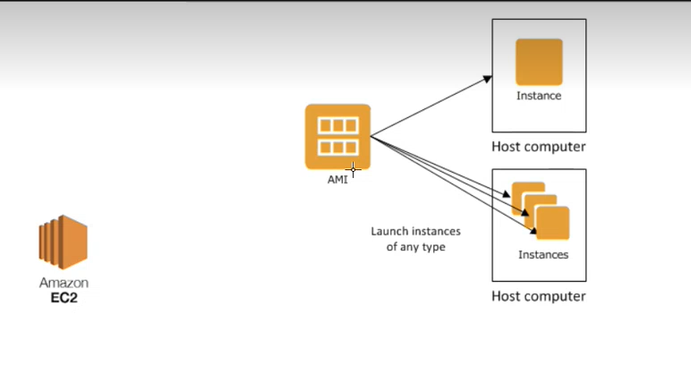

# cloud_computing_with_AWS

## Login Process
- Login to AWS account and change the password (Make sure to never share password with anyone)
- Change region to `ireland eu west 1`

----------------------------------------------------------------------------------------------------

## What is cloud computing?
- Cloud computing is a model of delivering on-demand access to a shared pool of computing resources, including servers, storage, databases, applications, and services, over the internet. Rather than storing and processing data on a local server or personal computer, cloud computing allows individuals and businesses to use computing resources provided by a third-party provider on a pay-as-you-go basis. This enables greater scalability, flexibility, and cost efficiency, as users can quickly and easily access additional computing resources as needed without having to invest in and manage their own physical infrastructure. Some examples of cloud computing services include cloud storage, software as a service (SaaS), platform as a service (PaaS), and infrastructure as a service (IaaS).

## Saas? 
- SaaS stands for "Software as a Service," and it is a cloud computing model in which software applications are delivered to users over the internet. With SaaS, the software is hosted on a cloud provider's infrastructure and made available to users through a web browser or a dedicated application.
## Paas?
- PaaS stands for "Platform as a Service," and it is a cloud computing model in which a provider offers a platform for building, deploying, and managing software applications over the internet.
## Iaas?
- IaaS stands for "Infrastructure as a Service," and it is a cloud computing model in which a provider offers virtualized computing resources over the internet, including servers, storage, and networking.

## What is AWS?
- AWS stands for Amazon Web Services, and it is a cloud computing platform provided by Amazon. AWS offers a wide range of cloud-based computing services, including computing power, storage, databases, networking, and security, among others. The platform allows individuals and businesses to quickly and easily access computing resources on-demand, without having to invest in and manage their own physical infrastructure. AWS is highly scalable, flexible, and cost-effective, making it a popular choice for businesses of all sizes. It is used for a wide range of applications, from hosting websites and web applications to running big data and machine learning workloads. AWS is a leader in the cloud computing industry, with a large and growing ecosystem of partners and developers.

## Public | Private | Hybrid -> Clouds
- Private Cloud: A private cloud is a cloud computing environment that is dedicated to a single organization. In a private cloud, the organization owns and manages the underlying infrastructure and resources, which are accessed and used exclusively by that organization. Private clouds can be located on-premises or hosted by a third-party provider.

- Public Cloud: A public cloud is a cloud computing environment that is open to the general public, and the underlying infrastructure and resources are owned and managed by a third-party cloud provider. Users can access and use computing resources on-demand, typically on a pay-as-you-go basis. Public clouds are highly scalable and cost-effective, making them a popular choice for businesses of all sizes.

- Hybrid Cloud: A hybrid cloud is a cloud computing environment that combines elements of both private and public clouds. In a hybrid cloud, organizations can use a mix of on-premises infrastructure and resources and resources provided by a third-party cloud provider. This allows organizations to take advantage of the scalability and cost-effectiveness of public clouds, while maintaining greater control and security over sensitive data and applications in their private cloud.

## OpEx vs CapEx
- CapEx is an upfront investment in assets that are expected to provide long-term benefits to the business. For example, building a data center or buying physical servers is considered a CapEx expense. The costs are incurred upfront and are depreciated over the asset's useful life.
- In contrast, OpEx is an ongoing expense that is incurred during the day-to-day operation of the business. For example, paying for cloud computing services is considered an OpEx expense. These costs are generally incurred on a monthly or yearly basis and are treated as operational expenses that can be written off as part of the ongoing costs of running the business.
- The adoption of cloud computing by organizations can facilitate a move from CapEx to OpEx, since the cloud service providers offer a pay-as-you-go pricing model. As a result, organizations pay only for the computing resources they utilize and can scale their resources up or down as per their requirements, without having to make significant upfront investments in infrastructure.

## Examples of companies that adopt cloud computing:
- Netflix: Netflix is a video streaming service that uses Amazon Web Services (AWS) to host and deliver its content to millions of subscribers around the world.
- Spotify: Spotify is a music streaming service that uses Google Cloud Platform to store and deliver its music to millions of users around the world
- Adobe: Adobe is a software company that provides creative tools and digital marketing solutions. It uses cloud computing to deliver its software as a service (SaaS) offerings, such as Adobe Creative Cloud and Adobe Marketing Cloud.

## Creating AMIs

### AMI Diagram
 

### Guide
- Launch an EC2 instance: Log in to the AWS Management Console, navigate to the EC2 service, and launch an EC2 instance. Make sure that the instance meets your requirements and has all the necessary software and configurations.
- Connect to the EC2 instance: Once the instance is up and running, connect to it using a Secure Shell (SSH) client.
- Install or update any software or dependencies you need on the EC2 instance.
- Stop the instance: Stop the instance once you have finished installing and configuring the software.
- Create an AMI: Select the stopped instance in the EC2 console, then choose the "Create Image" action from the "Actions" menu.
- .png)
- Wait for the AMI creation process to complete: Once you start the AMI creation process, it will take some time to complete. The time taken depends on the size of the instance and the amount of data stored on the instance.
- After it the ami has been setup and it is not in a pending state then you can delete you ec2 instance. 

## Key Points
- Make sure to never delete EC2 instance before the compeletion of you AMI. 

# Using AMIs to launch our app with a database
- Create two instances one being for the app and the other being for the database. This will cause us to have a two-tier infastructure. 
- `SSH` into both instances and run their individual provision scripts to have all the correct working dependencies and tools.
- Within the app make sure to create an `env var` with the databses ip address to connect to the database. 
- Launch the app and check to see if the webpage is available and if the information from the database is outputted to us.
- Now that we have our app working with our database we would now like to make 2 seperate `AMIs` for the instances we have created.
- Once these have made we can `terminate` our old instances as they are now saved as an AMI.
- Create an AMI for each instance by using the same `security group` for each AMI.
- Before we can launch our app we need to make changes to our `env var` because when we made our database AMI the ip has changed and so we need to reflect this change in our variable.
- Use the `unset`, followed by var name, command to remove the value stored in the `env var` and now set the variable with the new ip address of the database.
- We can now test and lauinch our app by using `npm start` and typing in the app ip address followed by the /posts page.

