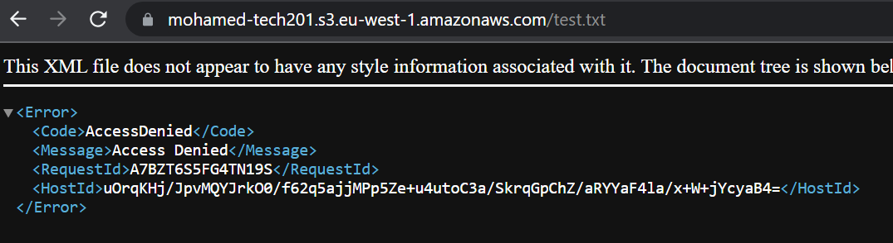

# cloud_computing_with_AWS

## Login Process
- Login to AWS account and change the password (Make sure to never share password with anyone)
- Change region to `ireland eu west 1`

----------------------------------------------------------------------------------------------------

## What is cloud computing?
- Cloud computing is a model of delivering on-demand access to a shared pool of computing resources, including servers, storage, databases, applications, and services, over the internet. Rather than storing and processing data on a local server or personal computer, cloud computing allows individuals and businesses to use computing resources provided by a third-party provider on a pay-as-you-go basis. This enables greater scalability, flexibility, and cost efficiency, as users can quickly and easily access additional computing resources as needed without having to invest in and manage their own physical infrastructure. Some examples of cloud computing services include cloud storage, software as a service (SaaS), platform as a service (PaaS), and infrastructure as a service (IaaS).

## Saas? 
- SaaS stands for "Software as a Service," and it is a cloud computing model in which software applications are delivered to users over the internet. With SaaS, the software is hosted on a cloud provider's infrastructure and made available to users through a web browser or a dedicated application.
## Paas?
- PaaS stands for "Platform as a Service," and it is a cloud computing model in which a provider offers a platform for building, deploying, and managing software applications over the internet.
## Iaas?
- IaaS stands for "Infrastructure as a Service," and it is a cloud computing model in which a provider offers virtualized computing resources over the internet, including servers, storage, and networking.

## What is AWS?
- AWS stands for Amazon Web Services, and it is a cloud computing platform provided by Amazon. AWS offers a wide range of cloud-based computing services, including computing power, storage, databases, networking, and security, among others. The platform allows individuals and businesses to quickly and easily access computing resources on-demand, without having to invest in and manage their own physical infrastructure. AWS is highly scalable, flexible, and cost-effective, making it a popular choice for businesses of all sizes. It is used for a wide range of applications, from hosting websites and web applications to running big data and machine learning workloads. AWS is a leader in the cloud computing industry, with a large and growing ecosystem of partners and developers.

## Public | Private | Hybrid -> Clouds
- Private Cloud: A private cloud is a cloud computing environment that is dedicated to a single organization. In a private cloud, the organization owns and manages the underlying infrastructure and resources, which are accessed and used exclusively by that organization. Private clouds can be located on-premises or hosted by a third-party provider.

- Public Cloud: A public cloud is a cloud computing environment that is open to the general public, and the underlying infrastructure and resources are owned and managed by a third-party cloud provider. Users can access and use computing resources on-demand, typically on a pay-as-you-go basis. Public clouds are highly scalable and cost-effective, making them a popular choice for businesses of all sizes.

- Hybrid Cloud: A hybrid cloud is a cloud computing environment that combines elements of both private and public clouds. In a hybrid cloud, organizations can use a mix of on-premises infrastructure and resources and resources provided by a third-party cloud provider. This allows organizations to take advantage of the scalability and cost-effectiveness of public clouds, while maintaining greater control and security over sensitive data and applications in their private cloud.

## OpEx vs CapEx
- CapEx is an upfront investment in assets that are expected to provide long-term benefits to the business. For example, building a data center or buying physical servers is considered a CapEx expense. The costs are incurred upfront and are depreciated over the asset's useful life.
- In contrast, OpEx is an ongoing expense that is incurred during the day-to-day operation of the business. For example, paying for cloud computing services is considered an OpEx expense. These costs are generally incurred on a monthly or yearly basis and are treated as operational expenses that can be written off as part of the ongoing costs of running the business.
- The adoption of cloud computing by organizations can facilitate a move from CapEx to OpEx, since the cloud service providers offer a pay-as-you-go pricing model. As a result, organizations pay only for the computing resources they utilize and can scale their resources up or down as per their requirements, without having to make significant upfront investments in infrastructure.

## Examples of companies that adopt cloud computing:
- Netflix: Netflix is a video streaming service that uses Amazon Web Services (AWS) to host and deliver its content to millions of subscribers around the world.
- Spotify: Spotify is a music streaming service that uses Google Cloud Platform to store and deliver its music to millions of users around the world
- Adobe: Adobe is a software company that provides creative tools and digital marketing solutions. It uses cloud computing to deliver its software as a service (SaaS) offerings, such as Adobe Creative Cloud and Adobe Marketing Cloud.


## Creating AMIs

### AMI Diagram
 

### Guide
- Launch an EC2 instance: Log in to the AWS Management Console, navigate to the EC2 service, and launch an EC2 instance. Make sure that the instance meets your requirements and has all the necessary software and configurations.
- Connect to the EC2 instance: Once the instance is up and running, connect to it using a Secure Shell (SSH) client.
- Install or update any software or dependencies you need on the EC2 instance.
- Stop the instance: Stop the instance once you have finished installing and configuring the software.
- Create an AMI: Select the stopped instance in the EC2 console, then choose the "Create Image" action from the "Actions" menu.
- .png)
- Wait for the AMI creation process to complete: Once you start the AMI creation process, it will take some time to complete. The time taken depends on the size of the instance and the amount of data stored on the instance.
- After it the ami has been setup and it is not in a pending state then you can delete you ec2 instance. 

## Key Points
- Make sure to never delete EC2 instance before the compeletion of you AMI. 


# Using AMIs to launch our app with a database
- Create two instances one being for the app and the other being for the database. This will cause us to have a two-tier infastructure. 
- `SSH` into both instances and run their individual provision scripts to have all the correct working dependencies and tools.
- Within the app make sure to create an `env var` with the databses ip address to connect to the database. 
- Launch the app and check to see if the webpage is available and if the information from the database is outputted to us.
- Now that we have our app working with our database we would now like to make 2 seperate `AMIs` for the instances we have created.
- Once these have made we can `terminate` our old instances as they are now saved as an AMI.
- Create an AMI for each instance by using the same `security group` for each AMI.
- Before we can launch our app we need to make changes to our `env var` because when we made our database AMI the ip has changed and so we need to reflect this change in our variable.
- Use the `unset`, followed by var name, command to remove the value stored in the `env var` and now set the variable with the new ip address of the database.
- We can now test and lauinch our app by using `npm start` and typing in the app ip address followed by the /posts page.


# S3 (Simple Storage Service)

## What is S3?
Amazon S3 (Simple Storage Service) is a scalable cloud-based object storage service offered by Amazon Web Services (AWS). S3 provides developers and IT teams with a highly available, durable, secure, and cost-effective storage infrastructure for storing and retrieving any amount of data, at any time and from anywhere on the web.

## What should we use S3?
- Durability: S3 is designed for 99.999999999% (11 9's) durability, which means that your data is highly resistant to loss and corruption. S3 stores data across multiple Availability Zones, so even if one zone fails, your data is still available.
- Cost-effectiveness: S3 offers a pay-as-you-go pricing model, which means that you only pay for the storage and bandwidth you use. S3 also offers several storage classes with different pricing options, so you can choose the option that best fits your needs and budget.
- Scalability: S3 is designed to be highly scalable, meaning that it can easily handle large amounts of data and traffic. You can store virtually unlimited amounts of data in S3, and you only pay for what you use.

## Benefits of S3?
- Scalability
- Durability
- Cost-effectiveness
- Easy-to-use

## Disaster Recovery in S3
- Amazon S3 (Simple Storage Service) provides several disaster recovery options to help ensure that your data is available and resilient in the event of a disaster, such as a natural disaster, hardware failure, or cyberattack. Examples:
    - AWS Backup: AWS Backup is a fully managed backup service that provides centralized backup and restore across AWS services, including S3. With AWS Backup, you can easily configure and automate backups of your S3 data, and quickly restore data in the event of a disaster.
    - Cross-Region Replication: Cross-Region Replication is a feature in S3 that automatically replicates data from one region to another, providing a cost-effective way to maintain a secondary copy of your data in a different geographic region. This can be useful in the event of a disaster that affects one region, as you can quickly switch to the secondary region to access your data.

## Best use case of S3
- Backup and disaster recovery: S3 provides a highly durable and cost-effective solution for backing up and archiving data. You can use S3 to store backups of your critical data and applications, and implement disaster recovery strategies to ensure that your data is available in the event of a disaster.
- IoT data storage and analysis: S3 can be used to store and analyze data from IoT devices, such as sensors and devices that collect data in real time. You can use S3 to store and manage the data, and then use AWS services such as AWS IoT Analytics to analyze the data and gain insights.

## How does S3 achieve high availability?
- Multi-Availability Zone (Multi-AZ) architecture: S3 automatically replicates your data across multiple Availability Zones (AZs) within a region, ensuring that your data is highly available and resilient to potential outages.
- Automatic failover: In the event of an outage in one Availability Zone, S3 automatically fails over to a healthy replica in another Availability Zone, ensuring that your data is always available.

## S3 in social media
- Amazon S3 (Simple Storage Service) can be used to store and serve multimedia content for social media platforms. Here are some of the ways in which S3 can be used for social media storage:
    - Image and video hosting: S3 can be used to store and serve images and videos for social media platforms. You can store large files on S3 and use the S3 API to serve them to users with low latency and high data transfer speeds.
    - Big data analytics: S3 can be used to store and analyze large amounts of social media data, such as posts, comments, and likes.

## CRUD 
- In Amazon S3 (Simple Storage Service), you can perform CRUD (Create, Read, Update, Delete) operations on objects in a bucket. 


# Setup aws cli to use S3 services.
- A step by step guide on how to setup aws cli to use services such as S3 on a command line:
    - Make a new EC2 instance on aws and ssh into it.
    - Update and upgrade all the tools and dependencies to have them up to date.
    - Now download python3 and pip on your linux terminal (use --version to check if tools have been downloaded).
    - Next type the command `aws configure` and fill out the fields to allow a secure connection to be made between you EC2 instance and the S3 service.
    - `access key` = your access key, `secret key` = your secret key, `region` = `eu-west-1`, 'datatype' = `json`.
    - To check if your connected run the command `aws s3 ls` and you should have a list buckets in your S3.
    - Now we can move onto making a bucket in S3 and this is done by running the command `aws s3 mb s3://mohamed-tech201`
    - Take care when naming your bucket as there is a naming convention put in place.
    - Now we can upload some information to our bucket by using the command `aws s3 cp s3://test.txt`
    - When we upload information to our bucket a URL is allocated to it to allow us to access it but the permission is denied to read the data.
    - 
    - We need to change the permission on the dashboard on aws to allow data to be read.
    - 
    - Now we are able to view the data
    - 


    ## S3 diagram

    

    # Autoscaling & Load balancers

    ## What is autoscaling in aws?
    - AWS Auto Scaling monitors your applications and automatically adjusts capacity to maintain steady, predictable performance at the lowest possible cost. Using AWS Auto Scaling, it's easy to setup application scaling for multiple resources across multiple services in minutes.

    ## Advantages of autoscaling
    - AWS Auto Scaling can help you optimize your utilization and cost efficiencies when consuming AWS services so you only pay for the resources you actually need. When demand drops, AWS Auto Scaling will automatically remove any excess resource capacity so you avoid overspending.

    ## What is a load balancer?
    - A load balancer serves as the single point of contact for clients. The load balancer distributes incoming application traffic across multiple targets, such as EC2 instances, in multiple Availability Zones. This increases the availability of your application. You add one or more listeners to your load balancer.

    ## Benefits of a load balancer
    - Load balancing lets you evenly distribute network traffic to prevent failure caused by overloading a particular resource. This strategy improves the performance and availability of applications, websites, databases, and other computing resources. It also helps process user requests quickly and accurately.

    ## ALB in AWS
    - Application Load Balancer (ALB) is a fully managed layer 7 load balancing service that load balances incoming traffic across multiple targets, such as Amazon EC2 instances. ALB supports advanced request routing features based on parameters like HTTP headers and methods, query string, host and path based routing. 

    

# Create an auto scaling group
- Step1 -> Choose your auto scaling group settings: First, you need to determine the desired settings for your auto scaling group. This includes things like the minimum and maximum number of instances in the group, the launch configuration or launch template to use for new instances, the availability zones to use, and the scaling policies that control when and how the group scales up or down.
- Step2 -> Create an launch configuration or launch template: Next, you'll need to create a launch configuration or launch template that specifies the instance type, AMI, security groups, and other configuration settings for your instances.
- Step3 -> Create the auto scaling group: Once you have your settings and launch configuration or launch template in place, you can create the auto scaling group itself. This involves specifying the group name, the launch configuration or launch template to use, the subnets and availability zones to use, and other settings like health check grace period.
- Step4 -> Add scaling policies: Once your auto scaling group is created, you can add scaling policies that define how and when the group should scale up or down. These policies can be based on metrics like CPU utilization or network traffic, and can specify how many instances to add or remove when scaling occurs.
- Step5 -> Test and monitor: Finally, you should test your auto scaling group to make sure it is working as expected, and monitor it to ensure it is scaling up and down appropriately in response to changes in demand.


# VPC

## What are VPCs?
- A VPC (Virtual Private Cloud) is a virtual network infrastructure that allows you to create isolated, logically defined network environments within a public cloud provider's infrastructure, such as Amazon Web Services (AWS) or Microsoft Azure.

- A VPC provides the ability to launch compute instances, storage resources, and other cloud services in a virtual network that is logically separated from other networks and services running in the same cloud provider's infrastructure.

## How do VPCs help a business?
- Security: By creating an isolated network environment with its own IP address range, subnets, and routing tables, a VPC allows businesses to define and control access to their cloud resources. They can configure security groups and network ACLs to restrict access to resources and protect them from unauthorized access.
- Cost-effective: Using a VPC can help businesses reduce their IT costs by eliminating the need for expensive physical networking hardware. With a VPC, they can deploy and manage their resources in the cloud, without the need for on-premises infrastructure.
- Scalability: VPCs are highly scalable, allowing businesses to easily add or remove resources as needed. They can add more compute instances, storage resources, or other cloud services to their VPCs, and they can expand their IP address range or create new subnets to accommodate growth.

## How do they help devops?
- The VPC restricts what sort of traffic, IP addresses and also the users that can access your instances. This prevents unwanted guests accessing your resources and secures you from things like DDOS attacks. Not all services require access to the internet, so those can be locked away safely within a private network.

## Why did aws introduce VPCs?
- AWS introduced VPC (Virtual Private Cloud) to provide customers with a dedicated, isolated virtual network environment in the cloud. Prior to VPC, customers using AWS services would have to rely on shared public networks or use dedicated leased lines to connect their on-premises data centers to AWS.

## Diagram of VPCs
```
                  +------------------+
                  |     Internet     |
                  +------------------+
                           |
                           |
                  +------------------+
                  |   Virtual Router |
                  |     (Amazon)     |
                  +--------+---------+
                           |
                           |
                  +--------v---------+
                  |     VPC Network  |
                  |   (Isolated Sub- |
                  |    Network)      |
                  +--------+---------+
                           |
            +--------------+-------------+
            |                            |
      +-----v-----+               +------v-------+
      |   EC2     |               |   EC2        |
      |  Instance |               |   Instance   |
      +-----------+               +--------------+

```
- In this diagram, there are three main components: the Internet, a virtual router, and a VPC network.

- The virtual router acts as the gateway between the VPC and the Internet. It is responsible for routing traffic between the Internet and the VPC network.

- The VPC network is an isolated subnet network where AWS resources, such as EC2 instances and RDS databases, are launched. The VPC network has its own IP address range, and it can be divided into subnets for added security.

# What is a internet gateway
- An internet gateway is a networking device that acts as an entry and exit point for data flowing between a local network and the internet. It provides a bridge between a local network, which typically has private IP addresses, and the public internet, which uses public IP addresses.

# What is a subnet
- A subnet is a part of a larger network that has been separated into smaller sections, each with its own unique range of IP addresses. This allows network administrators to better manage and organize their network traffic, as well as improve network security by limiting access to certain parts of the network. Essentially, subnets enable the division of a large network into smaller, more manageable segments.

# What is a CIDR?
- CIDR (Classless Inter-Domain Routing) is a way of allocating and managing Internet Protocol (IP) addresses. It is a more flexible and efficient way of allocating IP addresses than the previous system of IP address classes.

# What is ACL in aws?
- An access control list (ACL) is a mechanism you can use to define who has access to your buckets and objects, as well as what level of access they have. In Cloud Storage, you apply ACLs to individual buckets and objects. Each ACL consists of one or more entries.


# How to launch my own VPC for my app and databse?
- Step1 -> Firstly we need to create our own VPC.
- Step2 -> Create an internet gateway to allow access to the internet for our app. 
- Step3 -> Now we need to create 2 seperate subnets one being public for our app and the other being private for our database.
- Step4 -> We need to now create routing tables to set the flow of data between the subnets and the internet gateway. We need to associate our subnets to their repective routing table. For our app subnet it needs to be public so we need to allow access to all ip addresses by adding `0.0.0.0`. However, for our databse subnet we need it to be private as we do not want anyone to access it.
- Now we need to launch 2 instances in our new VPC. We can use our AMI's to launch our app instance with our public subnet and a databse instance using our private subnet.
- Now we need to ssh into our app instance and create an `env var` to allow a connection between our app and database. We need to now use our private ip address in our `env var` as we want our database to be private and so will not have a public ip address.
- Now we can launch our app and use our public ip address in our brower to view the content of the database.