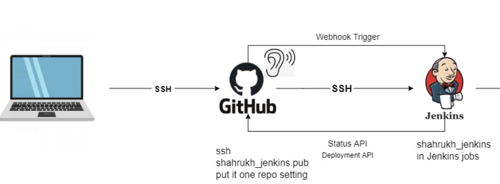

# How to setup a ssh connection between github and jenkins.
- Step1 -> Create a new job on jenkins and name it using your name to easily reference. Also, select freestyle project.
- Step2 -> Add a detailed description of what your job is going to do and what it will include.
- Step3 -> Make sure to check `Discard old builds` and set it to 3 to manage the number of build being tracked and stored. This is to prevent overloading the server and breaking it.
- Step4 -> Now check the option `Github Project` and include your HTTPS URL in the text box
- Step5 -> Now select `Restrict where this project can be run` to restrict the tests to be made in the agent node. 
- Step6 -> For the source code managment we need to select `git` and begin to create our key pair for the SSH protocol. Refernce `HTTPS_GITHUB.md` on how to generate rsa key.
- Step7 -> Add the public key to your repository own setting. It important that it is on the repo's setting.
- Step8 -> Now copy the private key over to jenkins. Make sure the kind used is `SSH Username with private key`. Save and make sure to select your private key. Also, make sure the branch finder is set to main as that is the default on github.
- Step9 -> For build triggers make sure to select `GitHub hook trigger` to allow changes to reflect from github to jenkins which will done through webhook. Guide on how to set this up will be below.
- Step10 -> Now select node & npm for our build environment as our project requires this.
- Step11 -> Now we need to write our script to start or test our project is working when it gets built. You will need to CD into you directory and run the commands `npm install` and `npm test`.

# How to setup the WebHook on github
- Go onto your repos settings and select webhooks and create a new webhook. For the payload URL enter your `own jenkins url` followed by `/github-webhook/`.
- Make sure the content type is `application/json` and then you can save the changes and the CI pipeline should now be all setup.
- Now you can make check the pipeline is working by pushing changes from localhost to github and seeing this being reflected onto your jenkins.

## CI pipeline diagram (Localhost -> GitHub -> Jenkins)
