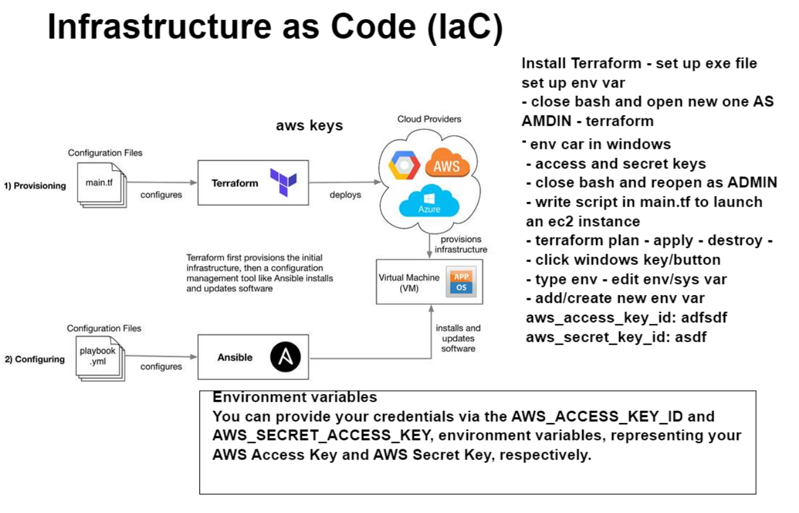

# Setting up terraform

- Download terraform onto your localhost machine, can follow video guide below.
```
https://www.youtube.com/watch?v=SkcRSJWNRS8
```
- Use the command `terraform --version` to check if installation was successful
- Now go onto your windows env var settings and setup two new variables, aws_access_key and aws_secret_key
```
AWS_ACCESS_KEY_ID = <Your access key>
AWS_SECRET_KEY = <Your secret key>
```

- Make a new folder on your localhost machine
``` 
mkdir Terraform
```
- Now enter the folder `cd Terraform` and make a new `tf` file
```
touch main.tf
```
- Open a `vscode` as `ADMIN` and enter the following code in there
```
provider "aws" {
    region = "eu-west-1"
}
```
- Install all the dependencies to allow terraform to work with aws
```
terraform init
```


- Now using the `resource` keyword we can begin to configure our ec2 instance
```
resource "aws_instance" "app_instance" {
    ami = "ami-0b137be80f38581ca"
    instance_type = "t2.micro"
    associate_public_ip_address = true
    tags = {
        Name = "tech201-mohamed-terraform-app"
    }  
}
```
- Enter the command `terraform plan` to check for any errors
- If that was successful enter the command `terraform apply` and check aws for your new ec2 instance
- You terminate the instance with the command `terrafrom destroy`


# IaC Diagram

